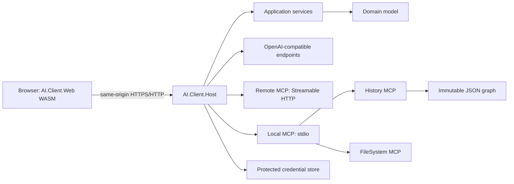

# Архитектура

## Текущий API-срез

Host предоставляет same-origin API `/api/projects` для CRUD метаданных проекта. `PUT` и `DELETE` принимают revision и возвращают `409 Conflict` при stale update. Web обращается к нему через интерфейс `IProjectApi`; browser не получает доступ к локальному файловому хранилищу напрямую.

Статус: Accepted

## Общая схема



## Проекты solution

```text
AI.Client.sln
├─ src/
│  ├─ AI.Client.Domain
│  ├─ AI.Client.Application
│  ├─ AI.Client.Contracts
│  ├─ AI.Client.Infrastructure
│  ├─ AI.Client.Web
│  ├─ AI.Client.Host
│  ├─ AI.Client.Mcp.History
│  └─ AI.Client.Mcp.FileSystem
└─ tests/
   ├─ AI.Client.Domain.Tests
   ├─ AI.Client.Application.Tests
   ├─ AI.Client.Storage.Tests
   ├─ AI.Client.Mcp.Tests
   └─ AI.Client.Web.Tests
```

Все test projects используют xUnit, Shouldly и Moq. Несмотря на разделение по модулям, это только модульные тесты: зависимости от HTTP, MCP transport, browser API, времени, ID generator, файловой системы и процессов заменяются mocks/fakes. Отдельный integration или end-to-end test project не создаётся.

### AI.Client.Domain

Не зависит от UI, HTTP, файловой системы, OpenAI SDK или MCP SDK. Содержит aggregate roots, value objects, инварианты и domain errors.

### AI.Client.Application

Содержит use cases, agent runner, policy evaluation, orchestration и интерфейсы портов. Зависит только от Domain и Contracts.

### AI.Client.Contracts

Содержит версионируемые DTO для взаимодействия WASM и Host, streaming events и сериализуемые MCP/AI-neutral contracts.

### AI.Client.Infrastructure

Содержит адаптеры OpenAI, OpenAI-compatible Chat Completions, MCP SDK, JSON storage, credential storage и системные часы/ID generators.

### AI.Client.Web

Blazor WebAssembly UI. Не содержит credentials и не обращается напрямую к AI endpoints или локальной файловой системе.

### AI.Client.Host

Локальный ASP.NET Core процесс:

- раздаёт опубликованные assets AI.Client.Web;
- предоставляет same-origin API и streaming endpoint;
- хранит credentials;
- запускает только зарегистрированные `stdio` MCP processes;
- подключается к Streamable HTTP MCP;
- выполняет agent loop и политики.

### MCP server projects

Отдельные исполняемые приложения. Каждый сервер поддерживает MCP lifecycle и `stdio`; при необходимости добавляется Streamable HTTP без изменения инструментов.

## Dependency inversion

Основные порты:

```csharp
public interface IAIEndpoint;
public interface IAIEndpointFactory;
public interface IMcpConnection;
public interface IMcpConnectionFactory;
public interface IProjectRepository;
public interface IChatRepository;
public interface IAgentRunner;
public interface IToolPolicyEvaluator;
public interface ICredentialStore;
public interface IClock;
public interface IIdGenerator;
```

Конкретные SDK-типы не должны пересекать границу Infrastructure.

Интерфейсы портов также являются test seams: модульные тесты Application не создают реальные OpenAI/MCP clients, а Storage и FileSystem logic проверяются через абстракции файловой системы без доступа к диску.

## Pure.DI

Каждый executable имеет собственный composition root. Компоненты и endpoints разрешаются только как объявленные roots. Запрещены глобальный `IServiceProvider`, runtime service locator и статические mutable state.

Ориентир для WASM composition root: `C:\Projects\DevTeam\dotnet-matrix\src\Matrix.Web\Composition.cs`.

## Взаимодействие WASM и Host

Базовые операции используют versioned HTTP API. Длительные операции возвращают поток `AgentEvent` через streaming HTTP response или WebSocket. Конкретный транспорт выбирается во время реализации после spike; domain contract от транспорта не зависит.

Host и WASM раздаются с одного origin. Это уменьшает CORS surface и позволяет использовать защищённую HttpOnly/SameSite session cookie.

## Запрещённые зависимости

- Domain → OpenAI SDK.
- Domain → MCP SDK.
- Web → credential store.
- Web → локальные пути файловой системы.
- AI adapter → UI types.
- MCP server → AI provider types.
- Model-provided tool name → прямой запуск процесса.
