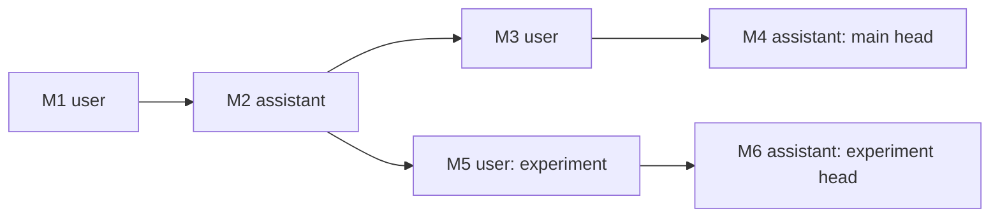

# Доменная модель

Статус: Accepted

## Aggregate roots

### Project

```text
Project
├─ ProjectId
├─ Name
├─ Description
├─ CreatedAt
├─ UpdatedAt
├─ DefaultEndpointId
├─ DefaultModelId
├─ SystemInstructions
├─ DirectoryGrants[]
├─ McpServerBindings[]
└─ ToolPolicies[]
```

Инварианты:

- имя не пустое;
- все вложенные ID уникальны внутри проекта;
- endpoint должен существовать в глобальном registry;
- policy ссылается только на подключённый MCP server;
- directory grant хранит нормализованный путь, подтверждённый Host;
- credentials не входят в aggregate.

### Chat

```text
Chat
├─ ChatId
├─ ProjectId
├─ Title
├─ CreatedAt
├─ UpdatedAt
├─ EndpointOverride
├─ Branches[]
└─ Revision
```

Инварианты:

- чат принадлежит ровно одному проекту;
- существует хотя бы одна ветка;
- head каждой ветки отсутствует только в пустом чате либо указывает на существующий node;
- `Revision` монотонно увеличивается при изменении refs/metadata.

### MessageNode

Узел неизменяем после записи.

```text
MessageNode
├─ MessageId
├─ ChatId
├─ ParentId?
├─ Role
├─ CreatedAt
├─ ContentParts[]
├─ AgentRunId?
├─ EndpointSnapshot?
└─ ProviderMetadata?
```

`ProviderMetadata` хранит provider response ID только как оптимизацию. Источником истины является локальный граф.

### AgentRun

```text
AgentRun
├─ AgentRunId
├─ ProjectId
├─ ChatId
├─ BranchId
├─ InputHeadMessageId
├─ Status
├─ StartedAt
├─ CompletedAt?
├─ PolicySnapshot
├─ EndpointSnapshot
├─ Steps[]
└─ Usage
```

Статусы:

```text
Pending → Running → Completed
                  → Cancelled
                  → Failed
                  → Interrupted
```

### ToolInvocation

```text
ToolInvocation
├─ InvocationId
├─ ProviderCallId
├─ McpServerId
├─ ToolName
├─ ToolSchemaHash
├─ Arguments
├─ PolicyDecision
├─ Approval?
├─ Result?
└─ Status
```

Повторная попытка обязана использовать сохранённый статус. Завершённый side-effecting invocation не исполняется повторно автоматически.

## Value objects

- Strongly typed UUID v7 IDs.
- `EndpointProfile` и `EndpointSnapshot`.
- `CredentialReference` без секретного значения.
- `DirectoryGrant`.
- `McpServerBinding`.
- `ToolIdentity` = configured server ID + tool name + schema hash.
- `ToolPolicy` = Allow, Ask или Deny.
- `ContentPart`: text, image reference, tool call, tool result, reasoning summary, error.

## Ветвление



Ветки являются refs, а не контейнерами сообщений:

```text
main       → M4
experiment → M6
```

Путь ветки восстанавливается проходом по `ParentId` до root. Fork — создание нового ref на существующий node. Новое сообщение создаёт immutable node и атомарно перемещает ref.

## Копирование между проектами

Копирование создаёт новые ChatId, BranchId, MessageId и AgentRunId. Provider IDs и старые approvals не переносятся как действующие полномочия. Инструменты и directories повторно сопоставляются с политикой целевого проекта.

