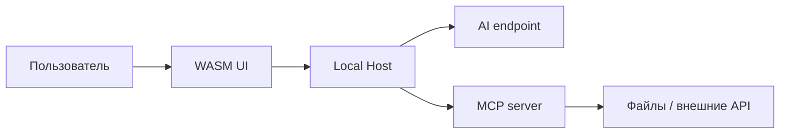

# Модель безопасности

Статус: Accepted

## Endpoint credentials

Endpoint profile metadata is stored in the project JSON document. API keys are excluded from that document and are stored by the Host gateway in a separate local file protected with Windows DPAPI (`CurrentUser`). The WebAssembly client receives only a `HasCredential` flag. When a saved profile is selected for a chat request, the Host resolves its credential locally before calling the OpenAI-compatible endpoint.

## Текущий security settings API

Настройки доступа проекта изменяются отдельной revisioned операцией `PUT /api/projects/{projectId}/security`. Один запрос содержит полный набор directory grants, MCP server bindings и per-tool policies; Host валидирует их как единое состояние и сохраняет атомарно. Несовпадение revision возвращает `409 Conflict` и не применяет частичное изменение.

Tool policy может ссылаться только на MCP server, присутствующий в том же документе настроек. UI предлагает `Ask` по умолчанию и не запускает MCP transport при его конфигурировании. Discovery инструментов, запуск server process и выдача фактических разрешений будут добавлены вместе с MCP connection manager.

## Границы доверия



Недоверенными считаются:

- текст пользователя;
- ответы AI;
- Markdown и ссылки;
- tool descriptions и annotations неизвестного MCP server;
- tool arguments модели;
- tool results;
- remote OAuth metadata до валидации;
- пути, переданные через UI или модель.

## Политика инструмента

Для каждого project и каждого ToolIdentity хранится:

```text
Allow — разрешить вызов в заданных ограничениях
Ask  — запросить подтверждение перед вызовом
Deny — не показывать инструмент модели и отклонять прямой вызов
```

Начальная политика любого нового или изменившегося инструмента — `Ask`.

Изменение tool schema hash сбрасывает сохранённое разрешение. `notifications/tools/list_changed` инициирует повторную оценку.

## Принятие решения

```text
Server enabled?
→ Tool descriptor valid?
→ ToolPolicy exists and schema hash matches?
→ Argument constraints satisfied?
→ Directory grant satisfied?
→ OAuth/server authorization satisfied?
→ Allow / Ask / Deny
```

Наиболее строгий результат побеждает. Tool annotation не может ослабить project policy.

## Directory grants

Права определяются отдельно для tools. Directory grants являются дополнительным ограничением аргументов FileSystem tools:

```text
DirectoryGrant
├─ CanonicalRoot
├─ Recursive
├─ IncludePatterns[]
├─ ExcludePatterns[]
└─ ToolNames[]
```

Например, `read` может иметь доступ ко всему project root, а `write` и `edit` — только к `src` и `docs`. `delete` может быть Deny независимо от directory grants.

Server-side проверки:

- `Path.GetFullPath` и platform-aware comparison;
- проверка containment после нормализации;
- защита от `..`;
- проверка symlink/junction/reparse point;
- повторная проверка непосредственно перед изменением;
- лимит размера и количества результатов;
- запрет широких roots без отдельного подтверждения.

Реализовано во встроенном сервере: `ToolNames` трактуются как capability (`read`, `write`, `edit`, `delete`) и передаются серверу при открытии сессии; `PathGuard` выполняет канонизацию, разрешение reparse point по всей цепочке, containment с учётом `Recursive` и проверку capability. Отсутствие grants означает отказ всех FileSystem tools. `IncludePatterns`/`ExcludePatterns`, отдельный инструмент удаления и запрет широких roots пока не реализованы. Подробности и лимиты: [инструменты по умолчанию](16-default-mcp-tools.md).

## Approval dialog

Показывает:

- project;
- MCP server и trust status;
- tool name/title;
- annotations как hints;
- аргументы;
- canonical target;
- diff для `edit`;
- ожидаемый эффект;
- scopes, которых не хватает;
- timeout и лимиты.

Варианты:

- разрешить один раз;
- разрешить до конца текущего AgentRun;
- сохранить `Allow` для текущего ToolIdentity;
- отклонить;
- сохранить `Deny`.

Постоянное разрешение не переносится между проектами.

## Hosted WASM security

Host слушает только loopback по умолчанию и раздаёт WASM и API с одного origin. Требуются:

- HttpOnly, SameSite session cookie;
- CSRF/origin validation для изменяющих запросов;
- Content Security Policy;
- запрет произвольных MCP executable/arguments из браузера;
- санитизация Markdown;
- отсутствие secrets в WASM configuration, logs и JSON history;
- ограничение размера запросов и streaming frames.

## stdio proxy risk

Web-to-stdio bridge является привилегированной границей. Host запускает только записи из локального registry, созданные пользователем вне model-controlled flow. Путь executable канонизируется, configuration подписывается или защищается от незаметной подмены, все запуски журналируются. Для сторонних servers рекомендуется sandbox/process isolation.

Официальное руководство: [MCP Security Best Practices](https://modelcontextprotocol.io/docs/2025-11-25/tutorials/security/security_best_practices).

## Markdown

Pipeline:

```text
Markdown source
→ Markdig with raw HTML disabled
→ HtmlSanitizer allowlist
→ safe Blazor MarkupString
```

Разрешаются только необходимые tags, attributes и URI schemes `http`/`https`. `javascript:`, event attributes, embedded forms и активный SVG запрещены.

## Credentials

- Web хранит только CredentialReference.
- Host хранит секреты в защищённом local credential store.
- На Windows key material защищается средствами текущего пользователя/OS.
- Секреты редактируются через masked UI и никогда не возвращаются обратно полностью.
- Logs используют redaction для headers, query parameters и JSON properties.

## Audit

Записываются project/policy changes, approvals, denials, MCP process starts, tool calls, canonical targets, result status, hashes и correlation IDs. Секреты и полный чувствительный content в audit не пишутся.
# Current scope

Глобальный раздел Security в текущей итерации является информационной страницей. Directory access задаётся только на уровне проекта:

- `Read only`;
- `Read/write`;
- доступ всегда рекурсивный;
- канонический путь symbolic link или junction не может выходить за границы grant;
- при пересечении директорий применяется наиболее специфичный grant.

MCP policy задаётся глобально на уровне MCP server и не переопределяется проектом.

## Инструменты управления приложением

Host поставляет собственный MCP-сервер [App tools](17-app-tools.md), который читает и меняет данные самого приложения. Он проходит те же проверки, что и любой другой сервер: включение глобально и в проекте, политика на каждый инструмент, сброс политики при смене schema hash, подтверждение перед вызовом.

Специальных ограничений на самоповышение привилегий у него нет: при политике `Allow` инструмент `app_security` может расширить directory grants своего проекта, изменить политику любого инструмента и включить произвольный MCP-сервер. Это осознанное решение для локального однопользовательского приложения — агент уже работает с правами учётной записи пользователя и располагает `process_run`. Единственной границей остаётся политика `Ask` по умолчанию и карточка подтверждения. Обоснование: [ADR-007](decisions/ADR-007-in-process-app-tools.md).

Секреты остаются односторонними и здесь: ключ можно записать и нельзя прочитать, а при замене глобальных настроек флаги наличия секретов пересчитываются из защищённого хранилища.
