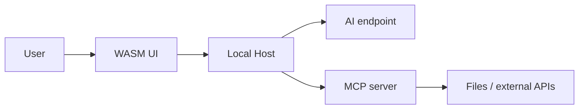

# Security model

Status: Accepted

## Endpoint credentials

Endpoint profile metadata is stored in the project JSON document. API keys are excluded from that document and are stored by the Host gateway in a separate local file protected with Windows DPAPI (`CurrentUser`). The WebAssembly client receives only a `HasCredential` flag. When a saved profile is selected for a chat request, the Host resolves its credential locally before calling the OpenAI-compatible endpoint.

## Current security settings API

Project access settings are changed by a single revisioned operation `PUT /api/projects/{projectId}/security`. One request contains the complete set of directory grants, MCP server bindings, and per-tool policies; the Host validates them as a single state and saves them atomically. A revision mismatch returns `409 Conflict` and does not apply a partial change.

A tool policy can only reference an MCP server that is present in the same settings document. The UI can discover tools through the MCP connection and offers the Host's built-in defaults for known tools. Unknown and external tools begin at `Ask`.

## Trust boundaries



Untrusted inputs:

- user text;
- AI responses;
- Markdown and links;
- tool descriptions and annotations of an unknown MCP server;
- model tool arguments;
- tool results;
- remote OAuth metadata before validation;
- paths passed through the UI or the model.

## Tool policy

For each project and each ToolIdentity, the following is stored:

```text
Allow — permit the call within the given constraints
Ask  — request confirmation before the call
Deny — do not show the tool to the model and reject direct calls
```

The initial policy for any new or changed external tool is `Ask`. Known Host tools that only read local files or application data, search, wait, ask the user, or navigate the app have explicit `Allow` defaults. Network fetches, writes, process and script execution, skill execution, and delegation still start at `Ask`. Unknown Host tool names also start at `Ask`.

A change in tool schema hash resets the stored permission. `notifications/tools/list_changed` triggers re-evaluation.

## Decision making

```text
Server enabled?
→ Tool descriptor valid?
→ ToolPolicy exists and schema hash matches?
→ Argument constraints satisfied?
→ Directory grant satisfied?
→ OAuth/server authorization satisfied?
→ Allow / Ask / Deny
```

The most restrictive result wins. A tool annotation cannot weaken the project policy.

## Chat approval mode

Each chat has a mode, chosen in the composer next to `+`, that answers a call its policy leaves at
`Ask` before any card is shown. `Deny`, the per-run call limits and directory grants apply in every
mode; the mode never touches them.

```text
Ask for approval — every such call waits for the approval card (the default, and every older chat)
Approve for me   — the chat-tool-risk-assess executor judges the call; only "allow" with risk
                   "low" runs without a card, anything else (including a failed or unreadable
                   assessment) shows the card with the assessment's reason
Full access      — every such call runs without asking
```

The assessment is one model call on the chat's own connection. It sees the user's latest request
on the branch, the project's directory grants, the tool's description and annotations (as
unverified hints) and the exact arguments, all passed as data. Switching the mode while a card
waits answers it: Full access lets the call through, and "Approve for me" gets one assessment.
Background subtasks, which have nobody to ask, run what the parent chat's mode would allow and
refuse the rest. A chat not created yet keeps the mode picked in its composer and is created with it.

## Directory grants

Permissions are defined separately for tools. Directory grants are an additional restriction on FileSystem tool arguments:

```text
DirectoryGrant
├─ CanonicalRoot
├─ Recursive
├─ IncludePatterns[]
├─ ExcludePatterns[]
└─ ToolNames[]
```

For example, `read` may have access to the entire project root, while `write` and `edit` only to `src` and `docs`. `delete` can be `Deny` regardless of directory grants.

Server-side checks:

- `Path.GetFullPath` and platform-aware comparison;
- containment check after normalization;
- protection against `..`;
- symlink/junction/reparse point check;
- re-check immediately before modification;
- size and result count limits;
- prohibition of broad roots without explicit confirmation.

Implemented in the built-in server: `ToolNames` are treated as a capability (`read`, `write`, `edit`, `delete`) and passed to the server when opening a session; `PathGuard` performs canonicalization, reparse point resolution along the entire chain, containment with regard to `Recursive`, and capability verification. The Host adds a private OS temporary directory grant for the current chat, even when the project has no directory grants. Sessions without a chat still reject FileSystem access when grants are absent. `IncludePatterns`/`ExcludePatterns`, a dedicated delete tool, and the prohibition of broad roots are not yet implemented. Details and limits: [default tools](16-default-mcp-tools.md).

## Approval dialog

Displays:

- project;
- MCP server and trust status;
- tool name/title;
- annotations as hints;
- arguments;
- canonical target;
- diff for `edit`;
- expected effect;
- missing scopes;
- timeout and limits.

Options:

- allow once;
- allow until the end of the current AgentRun;
- save `Allow` for the current ToolIdentity;
- deny;
- save `Deny`.

A persistent permission is not transferred between projects.

## Hosted WASM security

The Host listens only on loopback by default and serves WASM and API from a single origin. Required:

- HttpOnly, SameSite session cookie;
- CSRF/origin validation for mutating requests;
- Content Security Policy;
- prohibition of arbitrary MCP executable/arguments from the browser;
- Markdown sanitization;
- no secrets in WASM configuration, logs, or JSON history;
- size limits for requests and streaming frames.

## stdio proxy risk

The web-to-stdio bridge is a privileged boundary. The Host only launches entries from the local registry created by the user outside the model-controlled flow. The executable path is canonicalized, the configuration is signed or protected against unnoticed substitution, and all launches are logged. For third-party servers, sandbox/process isolation is recommended.

Official guide: [MCP Security Best Practices](https://modelcontextprotocol.io/docs/2025-11-25/tutorials/security/security_best_practices).

## Markdown

Pipeline:

```text
Markdown source
→ Markdig with raw HTML disabled
→ HtmlSanitizer allowlist
→ safe Blazor MarkupString
```

Only necessary tags, attributes, and URI schemes `http`/`https` are allowed. `javascript:`, event attributes, embedded forms, and active SVG are forbidden.

## Credentials

- Web stores only `CredentialReference`.
- The Host stores secrets in a protected local credential store.
- On Windows, key material is protected by the current user/OS.
- Secrets are edited through a masked UI and are never returned in full.
- Logs use redaction for headers, query parameters, and JSON properties.

## Audit

Project/policy changes, approvals, denials, MCP process starts, tool calls, canonical targets, result status, hashes, and correlation IDs are recorded. Secrets and full sensitive content are not written to the audit log.

# Current scope

The global Security section in the current iteration is an informational page. Directory access is set only at the project level:

- `Read only`;
- `Read/write`;
- access is always recursive;
- the canonical path of a symbolic link or junction cannot escape the grant boundaries;
- when directories intersect, the most specific grant applies.

MCP policy is set globally at the MCP server level and is not overridden by the project.

## Application management tools

The Host ships its own MCP server [App tools](17-app-tools.md), which reads and changes application data. It passes the same checks as any other server: global and project-level enablement, per-tool policy, policy reset on schema hash change, confirmation before invocation.

There are no special restrictions on privilege escalation: with an `Allow` policy, the `app_security` tool can expand its project's directory grants, change the policy of any tool, and enable arbitrary MCP servers. This is a deliberate decision for a local single-user application — the agent already runs with the user's account permissions and has `process_run`. The only boundary is the default `Ask` policy and the confirmation card. Rationale: [ADR-007](decisions/ADR-007-in-process-app-tools.md).

Secrets remain one-way here as well: a key can be written but not read, and when global settings are replaced, the presence flags of secrets are recalculated from the protected store.
