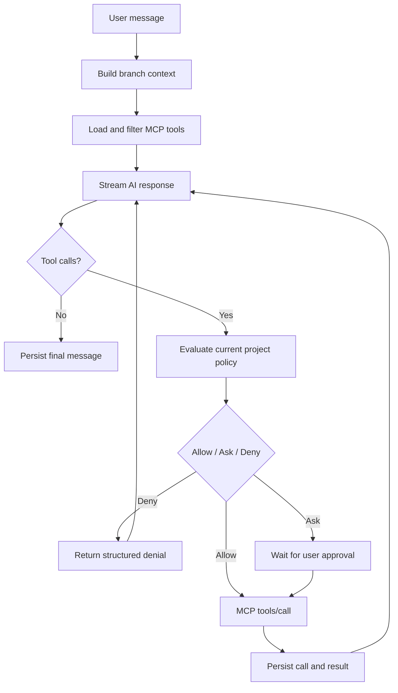

# AI endpoints and agent loop

Status: Accepted

> Current implementation (2026-09-07): a built-in stdio server with `process_run`, a streaming Chat Completions agent loop, confirmations, and call history have been implemented. See [default tools](16-default-mcp-tools.md). The descriptions of other servers, transports, and the Responses API below relate to the target architecture; the early preview sections reflect previous stages.


## Early live chat preview (historical stage)

For early manual verification, a Host-only adapter to OpenAI-compatible `POST {baseUrl}/chat/completions` is implemented. The Web UI passes the base URL, model, message, and optional API key to the local Host; the Host sends a single non-streaming request with `messages` and `stream: false`.

The API key is not stored in JSON, browser storage, logs, or source code. It exists only in UI memory and in one same-origin request to the Host. This preview is not an endpoint profile or agent loop: history is not saved, and streaming and MCP tools are not yet enabled. Permanent endpoint profiles and protected credential storage remain the next stage.

## Provider-neutral contract

The Application layer does not depend on the OpenAI SDK:

```csharp
public interface IAIEndpoint
{
    IAsyncEnumerable<AgentEvent> RunAsync(
        AgentRequest request,
        CancellationToken cancellationToken);
}
```

Implementations:

- `OpenAIResponsesEndpoint`;
- `OpenAIChatCompletionsEndpoint`;
- `OpenAICompatibleEndpoint`.

## Primary protocol

For OpenAI, the Responses API is used: it is recommended for new agent-like applications and models messages, function calls, and function call outputs as separate items. Chat Completions remains a fallback for compatible endpoints.

Official sources:

- [Migrate to the Responses API](https://developers.openai.com/api/docs/guides/migrate-to-responses)
- [Function calling](https://developers.openai.com/api/docs/guides/function-calling)
- [Conversation state](https://developers.openai.com/api/docs/guides/conversation-state)

## Endpoint profile

```text
EndpointProfile
├─ EndpointId
├─ DisplayName
├─ BaseUri
├─ Protocol: Responses | ChatCompletions | Auto
├─ CredentialReference
├─ DefaultModelId
├─ CustomHeaders
├─ CapabilityOverrides
├─ Timeout
└─ RetryPolicy
```

The profile is stored globally; the project references it and can set a default model. A chat can override the endpoint/model, but each AgentRun saves a full snapshot.

## Capability probe

The probe must not perform an expensive model request without confirmation. It checks endpoint availability, auth response, and declared/observed support for protocol features. The result is a hint and allows manual overrides.

## History and provider state

The local message graph is the source of truth. `previous_response_id` is stored as an optional optimization. On fork, endpoint change, `store: false`, provider retention expiry, or continuation error, the Host restores the input from the local branch path.

When managing reasoning history manually, the adapter must save and return all necessary provider items according to the selected API and model contract. Provider-specific items are stored in `AgentRun`/metadata but do not penetrate the Domain API.

## Agent loop



## Required properties of the loop

- Preserve provider `call_id`/tool-use identity.
- Validate arguments against MCP input schema before approval and invocation.
- Validate the structured result against output schema, if defined.
- Max iterations, max calls, deadline, and cancellation.
- Independent read-only calls may run in parallel only after policy evaluation.
- Side-effecting calls are executed sequentially by default.
- A completed invocation is not repeated automatically.
- Any result is treated as untrusted model input.
- The user sees the tool timeline and can stop the run.

## Streaming events

Provider events are converted to a stable contract:

```text
RunStarted
TextDelta
ReasoningSummaryDelta
ToolCallStarted
ApprovalRequired
ToolCallCompleted
UsageUpdated
RunCompleted
RunFailed
RunCancelled
```

The UI does not parse provider-specific SSE directly.

## Errors and retries

Retries are allowed for transient transport failures before any side effect begins, or for an explicitly idempotent invocation. `idempotentHint` from an unknown server is not sufficient for automatic retries. Rate limits and server retry hints are respected but bounded by the overall deadline.

## Branch context

The root → head path is converted to provider input. Technical audit messages are not added automatically. Tool calls and tool results are included as a pair, preserving the original IDs. When the context window is exceeded, an explicitly visible compaction strategy is applied; the original nodes are not changed.
