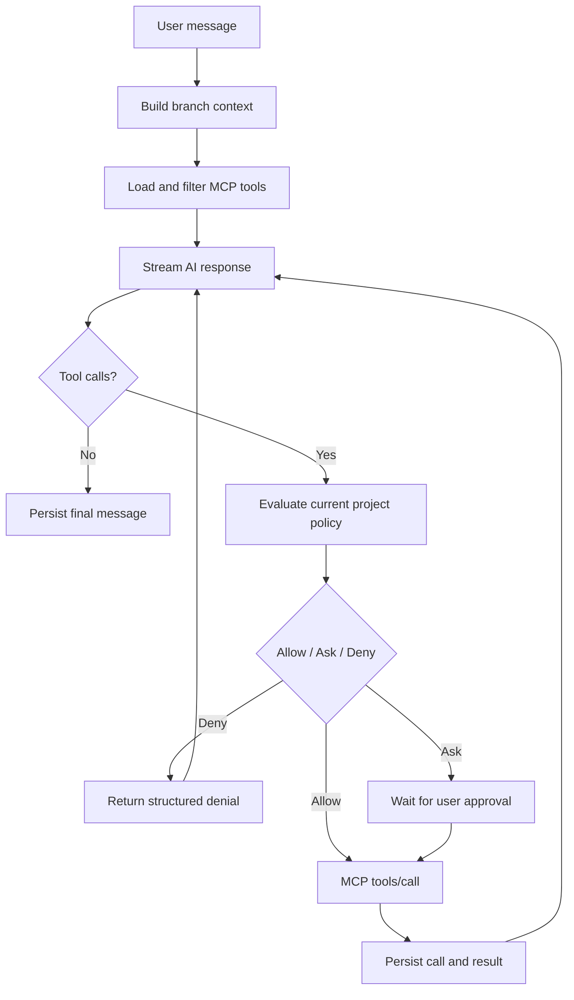

# AI endpoints и агентский цикл

Статус: Accepted

## Текущий live chat preview

Для ранней ручной проверки реализован Host-only adapter к OpenAI-compatible `POST {baseUrl}/chat/completions`. Web UI передаёт base URL, model, сообщение и необязательный API key в локальный Host; Host отправляет один non-streaming request с `messages` и `stream: false`.

API key не сохраняется в JSON, browser storage, логах или source code. Он существует только в памяти UI и в одном same-origin запросе до Host. Этот preview не является endpoint profile или agent loop: история не сохраняется, streaming и MCP tools ещё не включены. Постоянные endpoint profiles и защищённое credential storage остаются следующим этапом.

## Provider-neutral contract

Application layer не зависит от OpenAI SDK:

```csharp
public interface IAIEndpoint
{
    IAsyncEnumerable<AgentEvent> RunAsync(
        AgentRequest request,
        CancellationToken cancellationToken);
}
```

Реализации:

- `OpenAIResponsesEndpoint`;
- `OpenAIChatCompletionsEndpoint`;
- `OpenAICompatibleEndpoint`.

## Основной протокол

Для OpenAI используется Responses API: он рекомендован для новых agent-like приложений и моделирует сообщения, function calls и function call outputs отдельными items. Chat Completions сохраняется как fallback для совместимых endpoints.

Официальные источники:

- [Migrate to the Responses API](https://developers.openai.com/api/docs/guides/migrate-to-responses)
- [Function calling](https://developers.openai.com/api/docs/guides/function-calling)
- [Conversation state](https://developers.openai.com/api/docs/guides/conversation-state)

## Endpoint profile

```text
EndpointProfile
├─ EndpointId
├─ DisplayName
├─ BaseUri
├─ Protocol: Responses | ChatCompletions | Auto
├─ CredentialReference
├─ DefaultModelId
├─ CustomHeaders
├─ CapabilityOverrides
├─ Timeout
└─ RetryPolicy
```

Profile хранится глобально; project ссылается на него и может задавать default model. Chat может переопределить endpoint/model, но каждый AgentRun сохраняет полный snapshot.

## Capability probe

Probe не должен выполнять дорогой model request без подтверждения. Проверяются доступность endpoint, auth response и заявленная/наблюдаемая поддержка protocol features. Результат является подсказкой и допускает ручные overrides.

## История и provider state

Локальный message graph является источником истины. `previous_response_id` хранится как необязательная оптимизация. При fork, смене endpoint, `store: false`, истечении provider retention или ошибке continuation Host восстанавливает вход из локального пути ветки.

При ручном управлении reasoning history адаптер обязан сохранять и возвращать все необходимые provider items в соответствии с выбранным API и model contract. Provider-specific items хранятся в AgentRun/metadata, но не проникают в Domain API.

## Agent loop



## Обязательные свойства цикла

- Preserve provider `call_id`/tool-use identity.
- Валидация arguments по MCP input schema до approval и вызова.
- Валидация structured result по output schema, если она задана.
- Max iterations, max calls, deadline и cancellation.
- Независимые read-only calls могут выполняться параллельно только после policy evaluation.
- Side-effecting calls по умолчанию выполняются последовательно.
- Completed invocation не повторяется автоматически.
- Любой result считается недоверенным model input.
- Пользователь видит tool timeline и может остановить run.

## Streaming events

Provider events преобразуются в стабильный contract:

```text
RunStarted
TextDelta
ReasoningSummaryDelta
ToolCallStarted
ApprovalRequired
ToolCallCompleted
UsageUpdated
RunCompleted
RunFailed
RunCancelled
```

UI не анализирует provider-specific SSE напрямую.

## Ошибки и retries

Retry разрешён для transient transport failures до начала side effect или для явно idempotent invocation. `idempotentHint` неизвестного сервера недостаточен для автоматического retry. Rate limits и server retry hints учитываются, но ограничиваются общей deadline.

## Контекст ветки

Путь root → head преобразуется в provider input. Технические сообщения аудита не добавляются автоматически. Tool call и tool result включаются парой, сохраняя исходные IDs. При превышении context window применяется явно видимая стратегия compaction; исходные nodes не изменяются.
