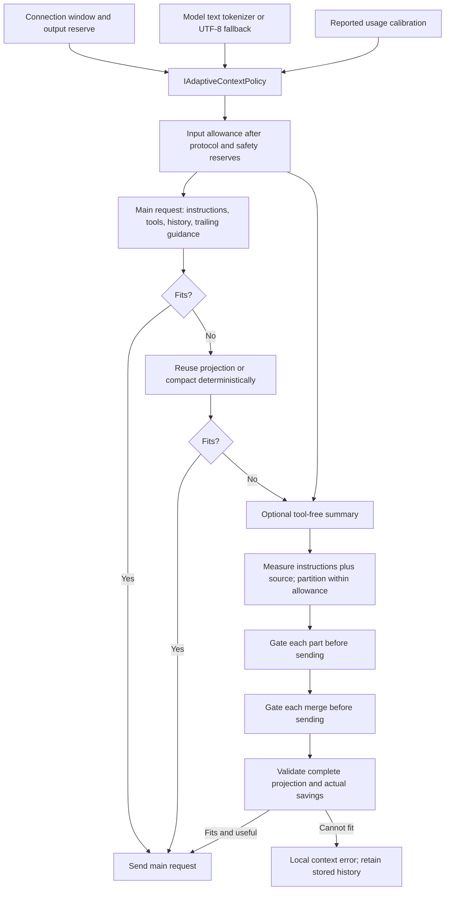

# Context request budgets and quality evaluation

Status: implemented. Decision: [ADR-011](decisions/ADR-011-budgeted-summary-requests.md).

## Request construction



Automatic ahead checkpoints and explicit manual compaction use the same summary path. They may
run before the main request reaches its hard limit. The diagram shows the final fallback path.

Let `U` be the policy's usable input allowance after output, protocol and calibrated safety reserves.
Tool-free summary calls may use `U`; every rendered prompt includes a user-role envelope. The final
target is `min(clamp(requested, 1, 4000), reservedOutput, U / 4)`. Targets below 64 disable the
operation. The part target is `min(target, clamp(target / 2, 1, 1500))`. Every input and merge is
rechecked before transport; output targets are prompt/local bounds, not provider generation caps.

One fitting source is summarized once. Larger sources preserve line boundaries when possible
and split long lines at Unicode-safe cuts. Numbered headers are budgeted conservatively. Parts
are summarized and merged recursively, up to four rounds and 64 total calls. A missing part,
failed call, unusable budget, work limit or non-converging merge leaves the original source in
place. Cancellation is never converted to a successful or empty summary.

Large tool results still use diagnostic/fact projection before source partitioning. The complete
formatted source is covered; this does not promise that every original log byte enters the model.

## Estimation and diagnostics

Recognized model names use offline Microsoft.ML.Tokenizers text counts with packaged Cl100k and
O200k vocabularies. The library owns model mappings. Unknown aliases and unavailable encodings use
the existing two-UTF-8-bytes estimate. Request wrappers, role envelopes and schema framing remain
estimates. Actual provider usage calibrates the safety reserve for the requested model separately.
No provider capability is inferred from successful tokenization.

`LLM context summary` records outcome, calls, formatted source tokens, total transmitted prompt
tokens, final result tokens, allowance and elapsed milliseconds. Transmitted tokens include merge
requests and can exceed source tokens. Final result tokens use the message estimator, including
its envelope. Failure records have zero final-result tokens even if earlier calls incurred usage.

`LLM context plan` includes `freed` and `reason`: `none`, `input_pressure`, `reused_projection`, or
`llm_fallback`. Savings compare the original projection with the final projection for this request;
they must not be summed across steps as newly saved tokens. The existing usage ledger provides
provider input/output/cache counts and reported or estimated cost for all production summary calls.
Stable application prefixes do not guarantee provider cache hits. Compare total cost, latency and
successful tasks before choosing thresholds; the 70%/80% thresholds are application heuristics.

## Offline correctness tests

The normal Server suite covers 2K–128K summary windows, smaller-model changes, reserve exhaustion,
complete source coverage, Unicode boundaries, parts and merges, cancellation, empty/error results,
work limits, model tokenizer fallback, concurrent model views and usage-calibration consistency.
Shared continuation fixtures cover constraints, decision reasons, paths, failures, rejected
alternatives and unfinished work across five summary generations. Mock contract tests prove that
this information reaches each request; they do not prove that a real model preserves it.

## Opt-in model quality evaluation

`evals/AI.Context.Evals` is outside `AI.slnx` and normal CI tests. It requires explicit
`AI_CONTEXT_EVAL=1`, `AI_CONTEXT_EVAL_BASE_URL` and `AI_CONTEXT_EVAL_MODEL`. Optional settings:
`AI_CONTEXT_EVAL_WINDOW` (8192), `AI_CONTEXT_EVAL_OUTPUT` (1000), and `AI_CONTEXT_EVAL_API_KEY`.
Keep credentials in the environment; they are never written to the report.

```powershell
$env:AI_CONTEXT_EVAL = '1'
$env:AI_CONTEXT_EVAL_BASE_URL = 'http://localhost:8080/v1'
$env:AI_CONTEXT_EVAL_MODEL = 'your-model'
dotnet test evals/AI.Context.Evals/AI.Context.Evals.csproj -v:normal
```

Without the enable switch the evaluation is skipped before any HTTP call. Choose a dedicated
endpoint; the run makes up to 21 calls for the built-in fixtures when each summary fits one input,
and more when source partitioning requires it, subject to each summary's work limit.

Compare full context, deterministic shortening and four successive LLM summaries against the
same continuation question. The JSON test output reports required-fact recall, total calls,
provider input/output/cached tokens and latency per case and strategy. `usageResponses` exposes
partial provider telemetry; unavailable token totals are null. A deterministic baseline may lose
facts and is measured without assuming semantic parity. Full and repeatedly summarized contexts
must retain the fixture identifiers. No fixed provider price is invented; use reported tokens
with the connection's prices, or the production usage ledger, to compare monetary cost.

Review answers for meaning as well: whether a rejected alternative remains rejected, a pending
approval remains pending, and unrun tests are not described as passed. Identifier recall alone
cannot detect every status reversal or unsupported inference. Extend fixtures from observed
failures before tuning budgets. No live quality result is claimed by an offline test run.

`evals/AI.Routing.Evals` checks the skill router the same way: the real `skill-route` request on
the model under test, for messages that should and should not put `team-assemble` first. It needs
`AI_ROUTING_EVAL=1`, `AI_ROUTING_EVAL_BASE_URL`, `AI_ROUTING_EVAL_MODEL` and optionally
`AI_ROUTING_EVAL_API_KEY`, makes one call per case, and reports each case's chosen skills.

```powershell
$env:AI_ROUTING_EVAL = '1'
$env:AI_ROUTING_EVAL_BASE_URL = 'http://localhost:8080/v1'
$env:AI_ROUTING_EVAL_MODEL = 'your-model'
dotnet build evals/AI.Routing.Evals/AI.Routing.Evals.csproj
evals/AI.Routing.Evals/bin/Debug/net10.0/AI.Routing.Evals.exe -showLiveOutput
```

The xUnit v3 runner is the test executable itself; the report is printed as test output.
